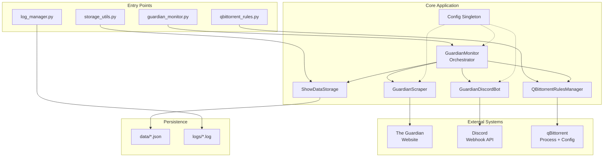
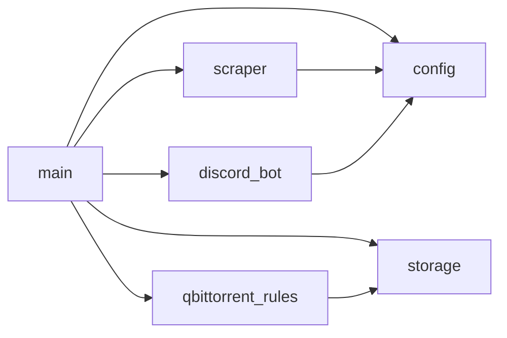
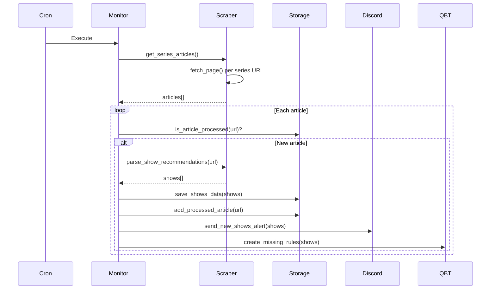

# Architecture

<!-- metadata:type=architecture, scope=system -->

## System Overview

## Design Patterns

### Orchestrator Pattern
`GuardianMonitor` in `app/main.py` coordinates all components. Each component is independently testable and has no cross-dependencies.

### Config Singleton
`app/config.py` exports a global `config` instance loaded at import time. All modules import from it. Sources: `config.ini` (tracked) + `.env` (secrets).

### Graceful Degradation
Optional features (Discord, qBittorrent) are checked at runtime. Missing configuration disables the feature rather than crashing.

### Idempotent Execution
`processed_articles.json` tracks which articles have been processed. Repeated runs are safe — duplicate processing is prevented.

### Cascading Parse Strategies
The scraper attempts multiple HTML parsing strategies in order, because Guardian article formats vary:
1. H2 headings with show details
2. Numbered H2/H3 headings
3. Bold numbered text patterns
4. Full body text parsing

### Process Lifecycle Management
qBittorrent rules require direct file manipulation of qBittorrent's config. The manager implements:
- Close process (graceful → force)
- Backup existing config (gzip compressed)
- Write new rules
- Restart process
- Rollback on failure

## Module Dependencies

## Data Flow

