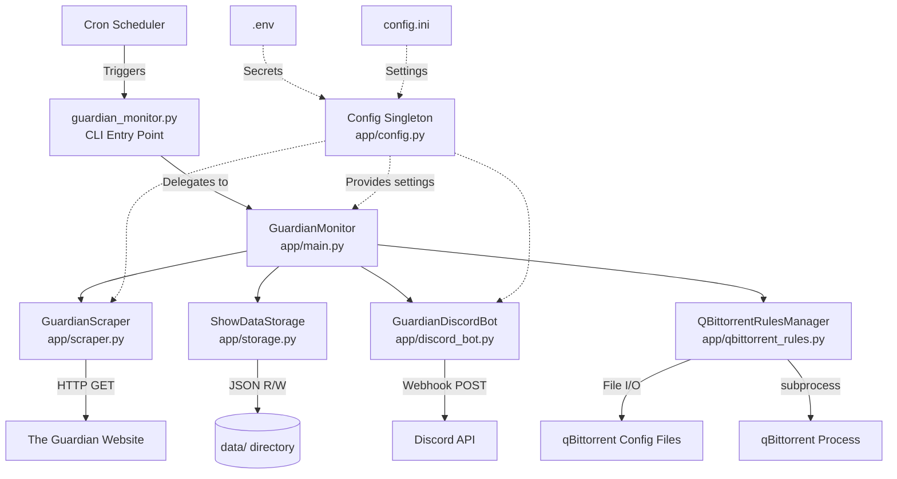
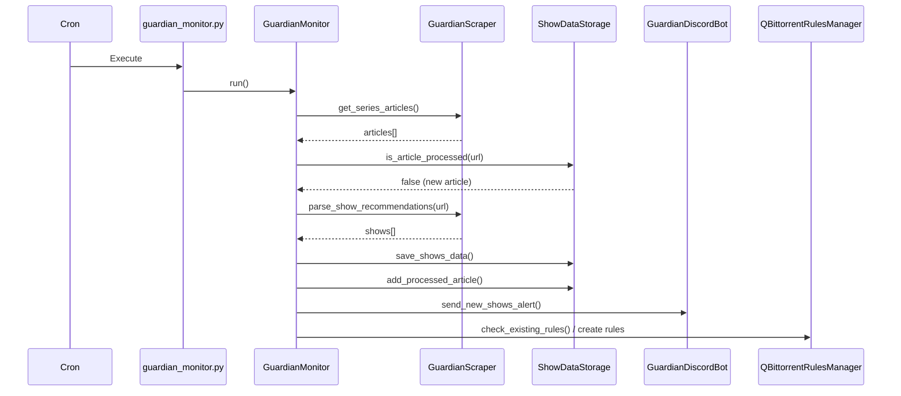

# Architecture

<!-- metadata:type=architecture, audience=ai-agents, updated=2026-05-29 -->

## System Architecture

## Design Patterns

### Orchestrator Pattern
`GuardianMonitor` (app/main.py) acts as the central orchestrator, coordinating all components in a defined sequence: scrape → store → notify → manage rules.

### Singleton Configuration
`Config` class in app/config.py instantiates a module-level `config` object imported by all modules. Loads from both `config.ini` (settings) and `.env` (secrets).

### Graceful Degradation
- Discord notifications are optional — the system works without them
- qBittorrent integration is optional — imported with try/except
- Error notifications are sent to Discord if configured, but failures don't halt execution

### Idempotent Execution
Each run checks `processed_articles.json` to determine if the latest article has already been handled, preventing duplicate notifications and data entries.

## Component Interaction Flow

## Error Handling Strategy

- Each component catches its own exceptions and logs them
- The orchestrator catches component failures and continues with remaining steps
- Discord error notifications are sent for critical failures (if configured)
- qBittorrent process management includes rollback (restart if closed)
