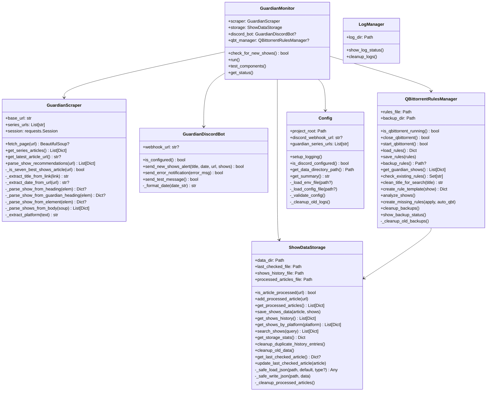

# Components

<!-- metadata:type=components, scope=classes -->

## Class Diagram

## Component Responsibilities

### GuardianMonitor (`app/main.py`)
Top-level orchestrator. Initializes all components, runs the check-for-new-shows workflow, provides test/status/config commands. Handles argument parsing for the CLI.

### GuardianScraper (`app/scraper.py`)
HTTP client that fetches Guardian series index pages, identifies article URLs, and parses show recommendations from article HTML. Implements multiple fallback parsing strategies due to inconsistent Guardian article formatting.

### ShowDataStorage (`app/storage.py`)
JSON-file-based persistence layer. Manages three data files: article deduplication registry, show history archive, and last-checked pointer. Includes corruption recovery (safe load with fallback), backup-on-write, and automatic cleanup (caps processed articles at 100).

### GuardianDiscordBot (`app/discord_bot.py`)
Discord webhook client. Formats show recommendations as rich embeds with article metadata and sends to configured channel. Supports error notifications and test messages.

### QBittorrentRulesManager (`app/qbittorrent_rules.py`)
Manages qBittorrent RSS auto-download rules. Reads show history from storage, generates search rules for each title, and writes them to qBittorrent's config file. Handles process lifecycle (close/restart) and config file backup/rollback. Also operates as standalone CLI.

### Config (`app/config.py`)
Singleton configuration loader. Merges `config.ini` (application settings) with `.env` (secrets). Provides logging setup with timestamped file rotation.

### LogManager (`app/log_manager.py`)
Simple log file rotation utility. Keeps maximum 10 log files, provides status reporting and manual cleanup CLI.
