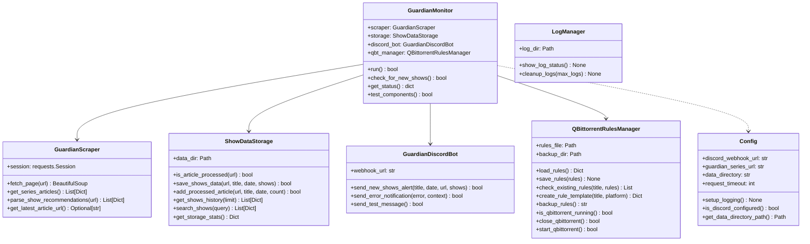

# Components

<!-- metadata:type=components, audience=ai-agents, updated=2026-05-29 -->

## Component Map

## Component Details

### GuardianMonitor (`app/main.py`)
The orchestrator. Initializes all components, runs the check-for-new-shows workflow, and provides status/test commands. Entry point for all application logic.

### GuardianScraper (`app/scraper.py`)
Scrapes The Guardian website. Uses multiple parsing strategies (h2 headings, numbered headings, bold text, body parsing) to extract show recommendations from articles. Handles URL pattern matching to identify "seven best shows" articles.

### ShowDataStorage (`app/storage.py`)
JSON-based persistence layer. Manages three files:
- `last_checked.json` — last processed article reference
- `processed_articles.json` — deduplication registry (auto-capped at 100 entries)
- `shows_history.json` — complete archive of all show recommendations

### GuardianDiscordBot (`app/discord_bot.py`)
Sends rich embed notifications via Discord webhooks. Formats show data with platform info, descriptions, and "pick of the week" indicators. Also handles error notifications.

### QBittorrentRulesManager (`app/qbittorrent_rules.py`)
Manages qBittorrent RSS auto-download rules. Can close/restart qBittorrent process, backup existing rules (gzip compressed), and create new rules from show titles. Operates on qBittorrent's `download_rules.json` config file directly.

### Config (`app/config.py`)
Singleton configuration loader. Reads `config.ini` for application settings and `.env` for secrets. Validates all values and provides a global `config` instance.

### LogManager (`app/log_manager.py`)
Manages timestamped log file rotation. Keeps maximum 10 log files.

### storage_utils.py (`app/storage_utils.py`)
CLI utility for storage operations: stats, history, search, platform filtering, cleanup, and reset. Not imported by the main application — standalone tool.
