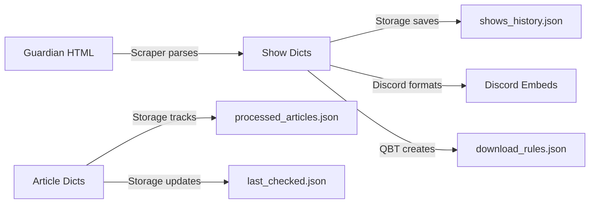

# Data Models

<!-- metadata:type=data-models, audience=ai-agents, updated=2026-05-29 -->

## Data Flow



## Core Data Structures

### Article Dictionary
Returned by `GuardianScraper.get_series_articles()`:
```python
{
    "url": "https://www.theguardian.com/tv-and-radio/2026/may/29/...",
    "title": "Seven best shows to stream this week",
    "date": "2026-05-29",       # YYYY-MM-DD extracted from URL
    "path": "/tv-and-radio/2026/may/29/..."
}
```

### Show Dictionary
Returned by `GuardianScraper.parse_show_recommendations()`:
```python
{
    "title": "Show Name",
    "platform": "Netflix",       # Extracted from article text
    "description": "Brief description of the show...",
    "pick_of_the_week": True     # Boolean, if marked as pick
}
```

## Persisted JSON Files

### data/last_checked.json
```python
{
    "url": "https://...",
    "title": "Seven best shows...",
    "article_date": "2026-05-29",
    "checked_at": "2026-05-29T08:30:00.000000",
    "last_updated": "2026-05-29T08:30:00.000000"
}
```

### data/processed_articles.json
```python
{
    "processed_urls": ["https://...", ...],  # List of URLs (max 100)
    "articles_info": {
        "https://...": {
            "title": "Seven best shows...",
            "date": "2026-05-29",
            "shows_count": 7,
            "processed_at": "2026-05-29T08:30:00.000000"
        }
    }
}
```
Auto-capped at 100 entries (oldest removed first).

### data/shows_history.json
```python
[
    {
        "article_url": "https://...",
        "article_title": "Seven best shows...",
        "article_date": "2026-05-29",
        "shows_count": 7,
        "processed_at": "2026-05-29T08:30:00.000000",
        "shows": [
            {
                "title": "Show Name",
                "platform": "Netflix",
                "description": "...",
                "pick_of_the_week": false
            }
        ]
    }
]
```
Grows indefinitely — designed as a comprehensive multi-year archive.

## qBittorrent Rule Structure

### ~/.config/qBittorrent/rss/download_rules.json
```python
{
    "Show Name": {
        "enabled": True,
        "mustContain": "show.name",
        "mustNotContain": "",
        "useRegex": False,
        "episodeFilter": "",
        "smartFilter": False,
        "previouslyMatchedEpisodes": [],
        "affectedFeeds": [],
        "ignoreDays": 0,
        "lastMatch": "",
        "addPaused": None,
        "assignedCategory": "",
        "savePath": ""
    }
}
```

## Data Retention Policies

| Data | Retention | Mechanism |
|------|-----------|-----------|
| Shows history | Indefinite | Grows as archive |
| Processed articles | 100 most recent | Auto-cleanup on write |
| Log files | 10 most recent | Auto-cleanup on write |
| qBittorrent backups | 10 most recent | Manual/auto cleanup |
