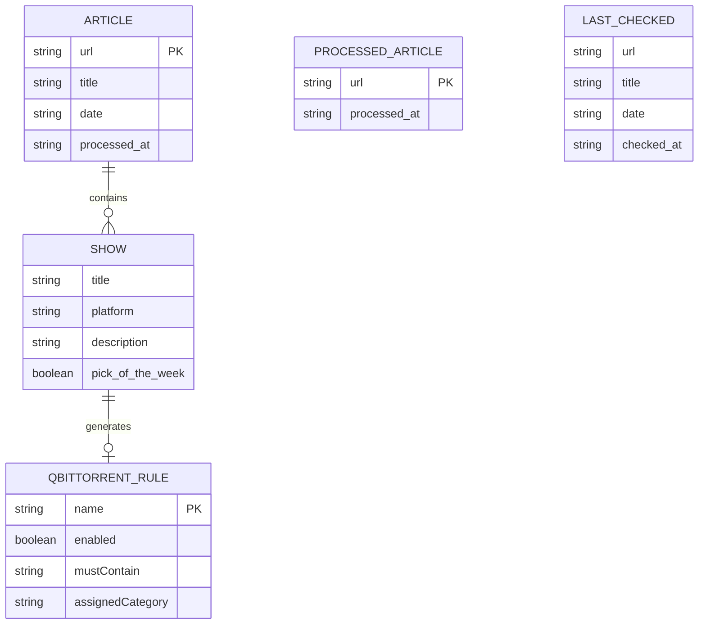

# Data Models

<!-- metadata:type=data-models, scope=json-schemas -->

## Data File Schemas

### shows_history.json

Complete archive of all show recommendations ever processed. Grows indefinitely.

```json
[
  {
    "article_url": "https://www.theguardian.com/tv-and-radio/2026/may/29/...",
    "article_title": "Seven best shows to stream this week",
    "article_date": "2026-05-29",
    "processed_at": "2026-05-30T08:30:00",
    "shows": [
      {
        "title": "Show Name",
        "platform": "Netflix",
        "description": "Brief description from the article.",
        "pick_of_the_week": true
      }
    ]
  }
]
```

### processed_articles.json

Deduplication registry. Auto-capped at 100 entries (oldest removed first).

```json
[
  {
    "url": "https://www.theguardian.com/tv-and-radio/2026/may/29/...",
    "processed_at": "2026-05-30T08:30:00"
  }
]
```

### last_checked.json

Pointer to the most recently processed article.

```json
{
  "url": "https://www.theguardian.com/tv-and-radio/2026/may/29/...",
  "title": "Seven best shows to stream this week",
  "date": "2026-05-29",
  "checked_at": "2026-05-30T08:30:00"
}
```

### qBittorrent download_rules.json

qBittorrent's native RSS download rules format (external system config).

```json
{
  "Rule Name - Show Title": {
    "addPaused": false,
    "assignedCategory": "Guardian Shows",
    "enabled": true,
    "mustContain": "show title search terms",
    "mustNotContain": "",
    "savePath": "",
    "useRegex": false,
    "episodeFilter": "",
    "smartFilter": false,
    "previouslyMatchedEpisodes": [],
    "affectedFeeds": [],
    "ignoreDays": 0,
    "lastMatch": ""
  }
}
```

## Data Relationships



## Internal Data Structures

### Article Dict (scraper output)
```python
{
    "url": str,        # Full article URL
    "title": str,      # Article headline
    "date": str,       # YYYY-MM-DD extracted from URL
    "path": str,       # URL path component
}
```

### Show Dict (parser output)
```python
{
    "title": str,            # Show title
    "platform": str,         # Streaming platform name
    "description": str,      # Article's description
    "pick_of_the_week": bool # True if marked as pick
}
```

### Storage Stats Dict
```python
{
    "total_shows": int,
    "total_articles": int,
    "platforms": Dict[str, int],    # platform -> count
    "date_range": {"earliest": str, "latest": str},
    "processed_articles_count": int,
}
```

## File Storage Strategy

- All data in `data/` directory (git-ignored)
- JSON format with human-readable indentation
- Atomic writes: write to temp file then rename
- Backup-on-write for shows_history.json
- Corruption recovery: returns default on parse failure
