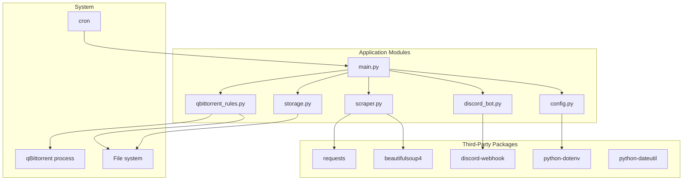

# Dependencies

<!-- metadata:type=dependencies, scope=packages -->

## Runtime Dependencies

| Package | Version | Purpose |
|---------|---------|---------|
| requests | ≥2.31.0 | HTTP client for Guardian scraping |
| beautifulsoup4 | ≥4.12.0 | HTML parsing of Guardian articles |
| python-dateutil | ≥2.8.0 | Date parsing utilities |
| discord-webhook | ≥1.3.0 | Discord notification delivery |
| python-dotenv | ≥1.0.0 | Load `.env` secrets |

## Development Dependencies

| Package | Version | Purpose |
|---------|---------|---------|
| pytest | ≥7.4.0 | Unit and integration testing |
| mypy | ≥1.5.0 | Static type checking |

## Standard Library Usage

| Module | Used By | Purpose |
|--------|---------|---------|
| `json` | storage, qbittorrent_rules | JSON serialization |
| `subprocess` | qbittorrent_rules | Process control (pgrep/pkill) |
| `configparser` | config | INI file parsing |
| `logging` | All modules | Application logging |
| `pathlib` | All modules | Path manipulation |
| `gzip` | qbittorrent_rules | Backup compression |
| `shutil` | storage | File operations (backup copy) |
| `argparse` | main | CLI argument parsing |
| `re` | scraper | Regex pattern matching |
| `time` | qbittorrent_rules | Sleep for process control |

## Dependency Graph

## System Requirements

- **Python**: 3.14 (development), mypy targets 3.10
- **OS**: Linux (uses `pgrep`/`pkill` for qBittorrent process control)
- **qBittorrent**: Optional; required only for RSS rule management
- **Network**: Required for Guardian scraping and Discord notifications
- **Cron**: External scheduler (not managed by the application)
