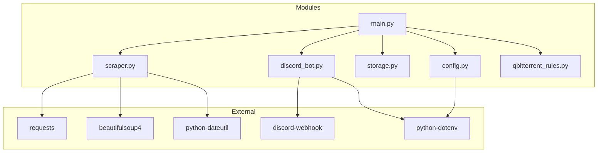

# Dependencies

<!-- metadata:type=dependencies, audience=ai-agents, updated=2026-05-29 -->

## Python Dependencies

| Package | Version | Purpose | Used By |
|---------|---------|---------|---------|
| requests | >=2.31.0 | HTTP client for web scraping | `scraper.py` |
| beautifulsoup4 | >=4.12.0 | HTML parsing | `scraper.py` |
| python-dateutil | >=2.8.0 | Date parsing utilities | `scraper.py` |
| discord-webhook | >=1.3.0 | Discord webhook integration | `discord_bot.py` |
| python-dotenv | >=1.0.0 | Load .env files | `config.py`, `discord_bot.py` |

## Standard Library Usage

| Module | Purpose | Used By |
|--------|---------|---------|
| `json` | JSON file I/O | `storage.py`, `qbittorrent_rules.py` |
| `subprocess` | qBittorrent process control | `qbittorrent_rules.py` |
| `configparser` | INI file parsing | `config.py` |
| `logging` | Application logging | All modules |
| `pathlib` | File path handling | All modules |
| `re` | URL pattern matching, text parsing | `scraper.py` |
| `gzip` | Backup compression | `qbittorrent_rules.py` |
| `argparse` | CLI argument parsing | `main.py`, `storage_utils.py` |
| `shutil` | File operations | `qbittorrent_rules.py` |
| `time` | Process wait delays | `qbittorrent_rules.py` |

## System Dependencies

| Dependency | Purpose | Required |
|------------|---------|----------|
| Python 3 | Runtime | Yes |
| cron | Scheduling | Recommended |
| qBittorrent | Download automation | Optional |
| Internet access | Scraping + Discord | Yes |

## Dependency Graph



## Installation

```bash
python3 -m venv venv
source venv/bin/activate
pip install -r requirements.txt
```

The `requirements.txt` is at the project root. No build system (setuptools, poetry, etc.) is used — direct pip install of dependencies.
