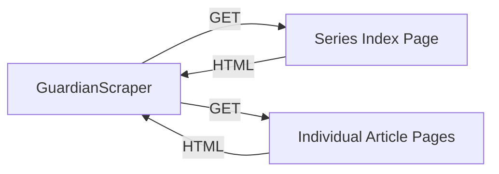
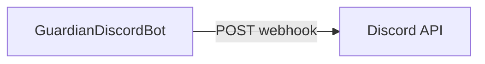
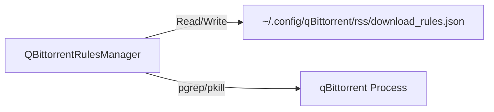

# Interfaces

<!-- metadata:type=interfaces, audience=ai-agents, updated=2026-05-29 -->

## CLI Interface

### guardian_monitor.py

| Command | Description |
|---------|-------------|
| `./guardian_monitor.py` or `run` | Check for new shows (default) |
| `./guardian_monitor.py test` | Test all components |
| `./guardian_monitor.py status` | Show current status |
| `./guardian_monitor.py config` | Show configuration |
| `./guardian_monitor.py help` | Show usage |

### app/qbittorrent_rules.py

| Command | Description |
|---------|-------------|
| `analyze` | Compare shows vs existing qBittorrent rules |
| `create` | Preview rules that would be created |
| `create --apply` | Create rules (requires qBittorrent closed) |
| `create --apply --auto-qbt` | Create rules with automatic qBittorrent management |
| `status` | Check qBittorrent process status |
| `backups` | Show backup files status |
| `cleanup` | Clean up old backup files |

### app/storage_utils.py

| Command | Description |
|---------|-------------|
| `stats` | Show storage statistics |
| `history --limit N` | Show recent history |
| `search <query>` | Search shows by text |
| `platform <name>` | Filter shows by platform |
| `cleanup --days N` | Remove old data |
| `cleanup-articles --max N` | Cap processed articles list |
| `duplicates` | Remove duplicate history entries |
| `reset` | Delete all stored data |

### app/log_manager.py

| Command | Description |
|---------|-------------|
| `status` | Show log files status |
| `cleanup` | Remove old log files (keeps 10) |

## External Integrations

### The Guardian Website (Inbound Data)

- **Series URL**: `https://www.theguardian.com/tv-and-radio/series/the-seven-best-shows-to-stream-this-week`
- **Protocol**: HTTPS GET with browser-like User-Agent
- **Rate limiting**: Sequential requests with configurable timeout
- **Retry**: Configurable retry attempts with delay

### Discord Webhook (Outbound Notifications)

- **Protocol**: HTTPS POST via `discord-webhook` library
- **Auth**: Webhook URL contains embedded credentials
- **Payload**: Rich embeds with show details, article links, platform info
- **Error notifications**: Separate embed format for error alerts

### qBittorrent (Local Process + File)

- **Rules file**: `~/.config/qBittorrent/rss/download_rules.json`
- **Process control**: `pgrep`, `pkill -TERM`, `pkill -KILL`, `Popen`
- **Backup**: Gzip-compressed copies in `~/.config/qBittorrent/rss/backups/`

## Internal Module Interfaces

### Config → All Modules
All modules import the global `config` singleton from `app/config.py`. Key attributes:
- `config.guardian_series_url` — URL to scrape
- `config.discord_webhook_url` — Discord webhook
- `config.request_timeout` — HTTP timeout
- `config.get_data_directory_path()` — data storage path
- `config.is_discord_configured()` — feature flag for Discord
