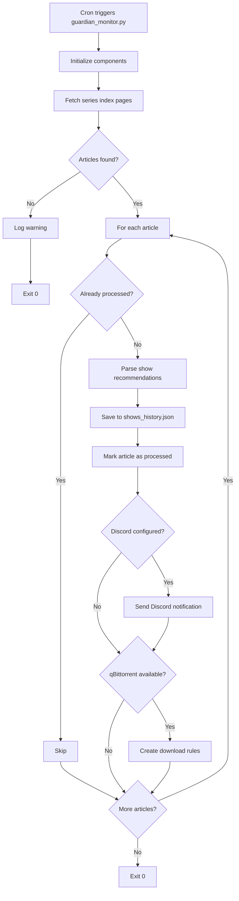
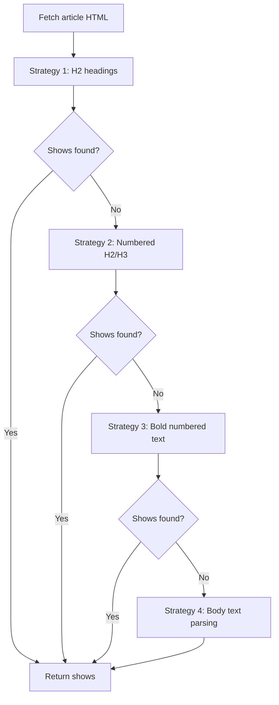

# Workflows

<!-- metadata:type=workflows, scope=processes -->

## Primary Workflow: Check for New Shows



## qBittorrent Rules Creation

```mermaid
flowchart TD
    START[create --apply --auto-qbt] --> LOAD[Load show history]
    LOAD --> EXISTING[Load existing rules]
    EXISTING --> DIFF[Identify missing rules]
    DIFF --> ANY{New rules needed?}
    ANY -->|No| DONE[Print "nothing to add"]
    ANY -->|Yes| RUNNING{qBittorrent running?}
    RUNNING -->|Yes| CLOSE[Close qBittorrent gracefully]
    CLOSE --> CLOSED{Closed OK?}
    CLOSED -->|No| FORCE[Force kill] --> BACKUP
    CLOSED -->|Yes| BACKUP[Backup existing config .gz]
    RUNNING -->|No| BACKUP
    BACKUP --> WRITE[Write merged rules JSON]
    WRITE --> RESTART[Start qBittorrent]
    RESTART --> VERIFY{Started OK?}
    VERIFY -->|Yes| SUCCESS[Print summary]
    VERIFY -->|No| ROLLBACK[Restore backup] --> FAIL[Exit error]
```

## Scraper Parsing Strategy



## Storage Cleanup Workflows

### Processed Articles Cleanup (automatic)
Triggered on every `add_processed_article()` call when count exceeds 100.
Removes oldest entries to maintain cap.

### Log File Cleanup
Manual or triggered by `config.setup_logging()`:
- Keeps maximum 10 timestamped log files
- Deletes oldest when limit exceeded

### qBittorrent Backup Cleanup
Manual via CLI. Keeps 10 most recent `.json.gz` backup files.

## Test Workflow


## Scheduling

- **When**: Fridays (Guardian publishes at 08:00 CET)
- **Recommended cron**: `30 8 * * 5` and `0 10 * * 5` (two checks)
- **Idempotent**: Safe to run multiple times; processed articles tracked
