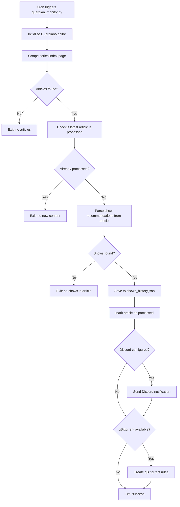
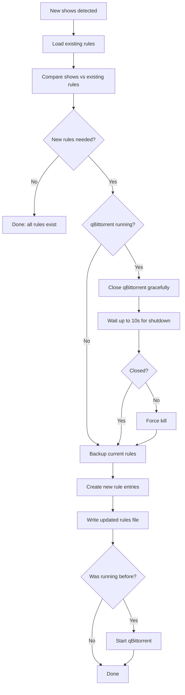
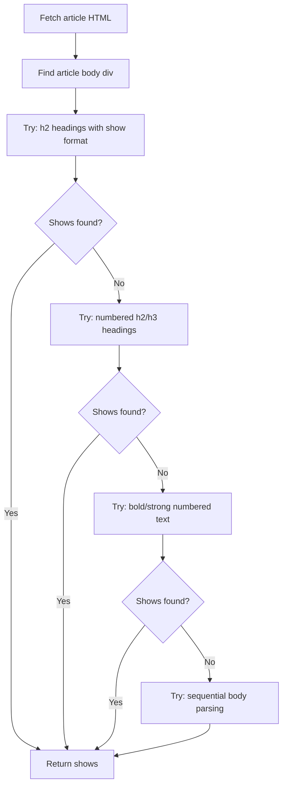

# Workflows

<!-- metadata:type=workflows, audience=ai-agents, updated=2026-05-29 -->

## Primary Workflow: Check for New Shows

## qBittorrent Rules Workflow

## Scraper Parsing Strategy

The scraper uses a cascading strategy because The Guardian's article format varies over time.

## Data Cleanup Workflows

### Automatic (on each run)
- Processed articles capped at 100 entries
- Log files capped at 10 (when `log_to_file = true`)

### Manual (via CLI utilities)
- `storage_utils.py cleanup-articles` — cap processed articles
- `storage_utils.py cleanup --days N` — remove old history (requires confirmation)
- `qbittorrent_rules.py cleanup` — remove old backup files
- `log_manager.py cleanup` — remove old log files

## Scheduling

| Schedule | Cron Expression | Rationale |
|----------|----------------|-----------|
| Primary check | `30 8 * * 5` | 30 min after Guardian's 08:00 CET publish time |
| Backup check | `0 10 * * 5` | Catch late publications |
| Conservative | Add `0 11 * * 5` | Third check for reliability |
