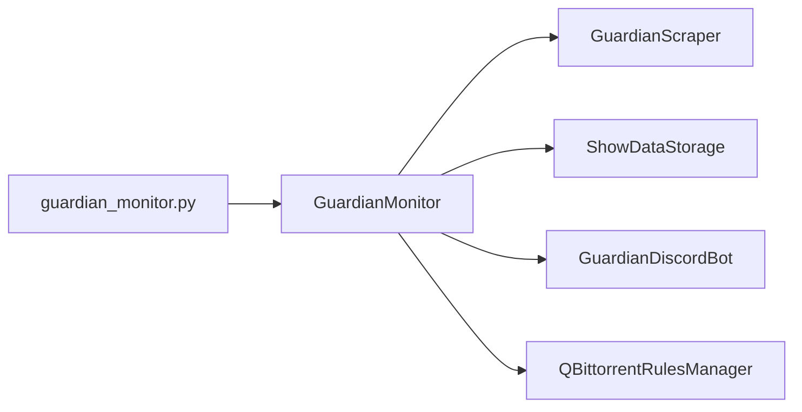

# AGENTS.md

<!-- metadata:type=agent-guide, updated=2026-06-17 -->

## Project Overview

Python CLI tool that monitors The Guardian's weekly "Seven Best Shows to Stream" article series. Runs as a single-shot cron job on Fridays. Scrapes articles, persists show data to JSON, sends Discord webhook notifications, and optionally creates qBittorrent RSS download rules.

## Directory Map

```
guardian_monitor.py          → CLI entry point (maps commands to app/main.py)
app/
├── main.py                  → GuardianMonitor orchestrator (core workflow)
├── config.py                → Config singleton (loads config.ini + .env)
├── scraper.py               → GuardianScraper (HTML parsing, multiple strategies)
├── storage.py               → ShowDataStorage (JSON file persistence)
├── discord_bot.py           → GuardianDiscordBot (webhook notifications)
├── qbittorrent_rules.py     → QBittorrentRulesManager (also standalone CLI)
├── log_manager.py           → LogManager (log rotation, standalone CLI)
├── storage_utils.py         → Storage CLI utility (stats, search, cleanup)
├── test_integration.py      → Integration test (uses main() pattern, not pytest)
└── test_discord_sample.py   → Discord notification test
config.ini                   → App settings (URLs, timeouts, logging)
.env                         → Secrets (DISCORD_WEBHOOK_URL, DISCORD_BOT_TOKEN)
data/                        → JSON persistence (git-ignored)
logs/                        → Timestamped log files (git-ignored)
tests/                       → Pytest unit tests (test_scraper, test_storage, test_integration)
specs/                       → Feature specifications (pytest config, JSON validation, type checking)
```

## Architecture



**Flow**: Scrape Guardian → Check if new → Save to JSON → Notify Discord → Create qBittorrent rules

**Key patterns**:
- Orchestrator in `app/main.py` coordinates all components
- Config singleton (`from config import config`) used everywhere
- Graceful degradation: Discord and qBittorrent are optional
- Idempotent: `processed_articles.json` prevents duplicate processing
- Cascading scraper: tries 4 parsing strategies because Guardian article format varies

## Configuration

| Source | Contains | Tracked in Git |
|--------|----------|----------------|
| `config.ini` | URLs, timeouts, log settings, data path, HTTP settings | Yes |
| `.env` | `DISCORD_WEBHOOK_URL`, `DISCORD_BOT_TOKEN` | No (`.env.example` tracked) |

Config is loaded once at module import time via the global `config` instance in `app/config.py`.

## Data Files (in `data/`)

| File | Purpose | Retention |
|------|---------|-----------|
| `shows_history.json` | Complete archive of all shows | Indefinite |
| `processed_articles.json` | Deduplication registry | Auto-capped at 100 |
| `last_checked.json` | Last processed article reference | Single entry |

## Notable Implementation Details

- **Scraper uses cascading parsing**: Tries h2 headings → numbered h2/h3 → bold numbered text → body parsing. This is because The Guardian's article format varies.
- **qBittorrent rules management** requires closing the qBittorrent process to write its config file. The code handles close → backup → write → restart with rollback on failure.
- **sys.path manipulation**: `guardian_monitor.py` adds `app/` to `sys.path` at runtime to import modules without a package structure.
- **Scheduling**: Designed for Friday-only cron execution (Guardian publishes Fridays 08:00 CET). Recommended: `30 8 * * 5` and `0 10 * * 5`.
- **Multiple series**: Monitors both "Seven Best Shows to Stream" and "Seven Best Films to Watch on TV" series.
- **Storage safety**: JSON writes use corruption recovery (safe load with fallback to defaults) and backup-on-write.

## Testing

- **pytest** (`tests/`): Unit tests for scraper, storage, and integration tests requiring network
- **Manual test scripts** (`app/test_integration.py`, `app/test_discord_sample.py`, `demo_restart.py`, `test_qbt_restart.py`): Use `if __name__ == "__main__"` pattern
- **mypy**: Configured in `pyproject.toml` targeting Python 3.10

## Detailed Documentation

For deeper information, see `.agents/summary/`:
- `index.md` — Navigation guide and cross-references
- `architecture.md` — Full system diagrams and design patterns
- `components.md` — Class diagrams and method signatures
- `interfaces.md` — All CLI commands and external integrations
- `data_models.md` — JSON schemas and data structures
- `workflows.md` — Flowcharts for all processes
- `dependencies.md` — Package list and dependency graph

## Custom Instructions
<!-- This section is for human and agent-maintained operational knowledge.
     Add repo-specific conventions, gotchas, and workflow rules here.
     This section is preserved exactly as-is when re-running codebase-summary. -->
